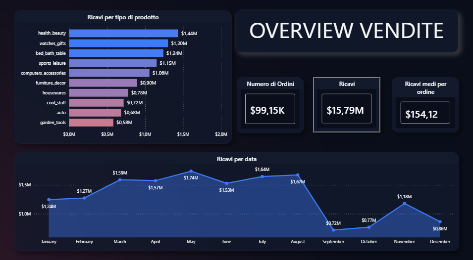
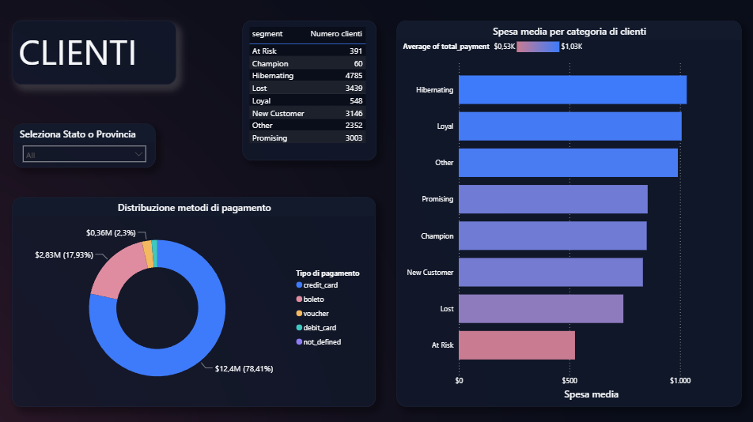
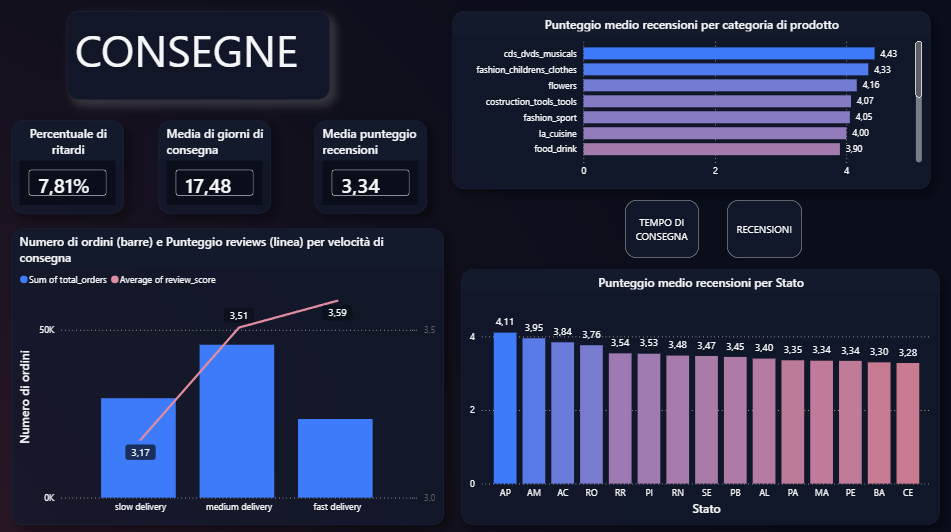
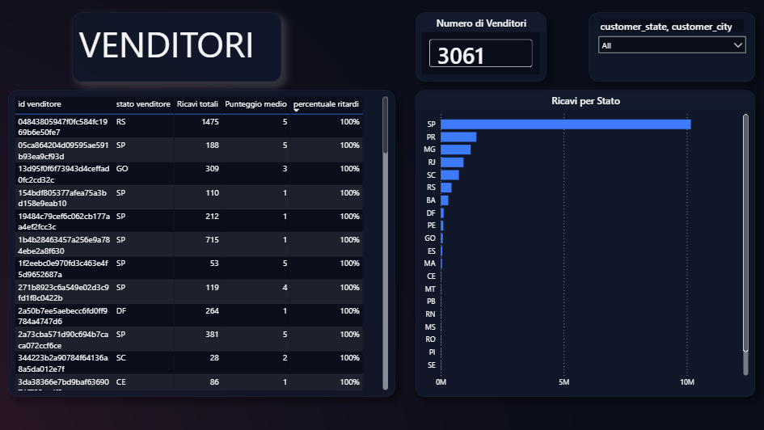
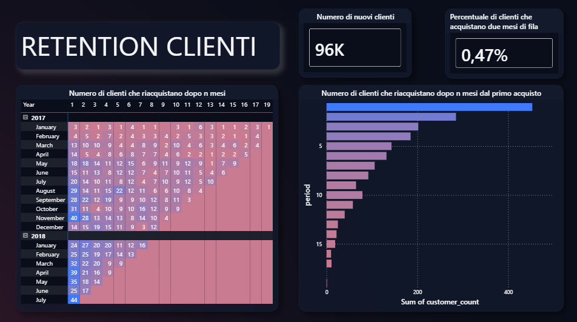

Customer & Sales Analytics — Olist E-commerce

1. Sommario Esecutivo
Progetto di analisi end-to-end su un dataset e-commerce brasiliano reale (Olist, ~100.000 ordini,
periodo 2016–2018). L'obiettivo è ricostruire il percorso cliente dall'acquisto alla consegna,
segmentare la base clienti per comportamento d'acquisto, misurare le performance dei venditori e
la retention nel tempo, fornendo una dashboard Power BI pronta per il management.

Dataset: Brazilian E-Commerce Public Dataset by Olist
(Kaggle, 9 tabelle, licenza CC BY-NC-SA 4.0). I CSV grezzi non sono inclusi in questo repository —
scaricali dal link sopra ed estraili in una cartella dataset/ nella root del repo (allo stesso
livello di notebooks/) per eseguire il notebook Python in locale.

***
2. Problema di Business
Un marketplace e-commerce con migliaia di venditori indipendenti deve rispondere a queste domande:
Quali categorie di prodotto generano più ricavi e come si muove il trend mese su mese?
Come si segmenta la base clienti in base al comportamento d'acquisto (RFM) e quali metodi di
  pagamento preferisce?
Le consegne rispettano i tempi promessi? Come impattano i ritardi sulle recensioni dei clienti?
Quali venditori performano meglio (ricavi, puntualità, recensioni) e quali richiedono attenzione?
Quanti clienti tornano ad acquistare dopo il primo ordine, e con quale frequenza?

***
3. Metodologia
Il progetto segue una pipeline in tre fasi: Python → SQL (Architettura Medallion) → Power BI.

Python (notebooks/progetto_customers_analysis.ipynb) è stato usato per l'EDA iniziale sui 9
CSV originali, il calcolo della segmentazione RFM (Recency, Frequency, Monetary) su
customer_unique_id e la costruzione della logica di cohort analysis, poi caricati in SQL
Server come tabelle di supporto per il layer Silver.

Il Bronze Layer contiene il dato grezzo ingestito dai 9 CSV Olist senza trasformazioni, con
controlli completi di qualità: valori nulli, duplicati, outlier su prezzo e pagamenti, inversioni
temporali tra le date di consegna (~1.300 casi individuati).

Il Silver Layer pulisce e tipizza il dato: distingue customer_id (per ordine) da
customer_unique_id (persona reale, chiave per l'RFM), calcola i giorni di consegna e il flag di
ritardo, traduce le categorie prodotto dal portoghese all'inglese.

Il Gold Layer espone 5 view, una per pagina dashboard così i filtri incrociati funzionano su
tutti i visual contemporaneamente: gold.overview, gold.customers, gold.delivery,
gold.sellers, gold.cohort.

La dashboard Power BI è strutturata in 5 pagine — Overview, Clienti, Consegne, Venditori,
Retention — con un tema custom dark disegnato per coerenza visiva con gli altri progetti del
portfolio.

***
4. Competenze Tecniche
Area	Strumenti e Tecniche
Analisi esplorativa	Python (pandas) — EDA, RFM segmentation, cohort analysis
Architettura dati	Medallion Architecture (Bronze/Silver/Gold)
Storage	SQL Server
Trasformazione dati	SQL — CTE, Window Functions (DATEDIFF, MIN OVER), CASE WHEN, JOIN multi-tabella
Qualità del dato	Null check, duplicate check, coerenza temporale tra date, outlier su prezzo/pagamenti
Reporting	Power BI — misure DAX, formattazione condizionale, tema custom, drill tra pagine
	***
5. Risultati

Overview
Nel periodo analizzato lo store genera $15,79M di ricavi su 99,15K ordini, per uno
scontrino medio di $154,12. Le categorie più redditizie sono health_beauty ($1,44M) e
watches_gifts ($1,30M). Il trend mensile mostra una forte tenuta tra gennaio e agosto (tra $1,24M
e $1,74M/mese), seguita da un calo marcato negli ultimi mesi (fino a $0,72M) — è una caratteristica
nota del dataset Olist, che raccoglie dati completi solo fino a settembre 2018: gli ultimi mesi
sono sotto-rappresentati per troncamento della raccolta, non per un reale calo di mercato.

Clienti
Il credit_card è il metodo di pagamento dominante (78,41% del valore, $12,4M), seguito da boleto
(17,93%). La segmentazione RFM evidenzia una base clienti in gran parte "Hibernating" (4.785
clienti) e "Lost" (3.439), a fronte di soli 60 "Champion" — un profilo tipico di un marketplace a
bassissima frequenza di riacquisto, coerente con quanto noto sul dataset Olist.

Consegne
Il 7,81% degli ordini arriva in ritardo, con un tempo medio di consegna di 17,48 giorni. Il
punteggio medio recensioni è 3,34/5. La categoria con le recensioni migliori è cds_dvds_musicals
(4,43), quella con le peggiori è food_drink (3,90). A livello geografico gli stati del nord (AP,
AM, AC) registrano i punteggi più alti, quelli più periferici (PE, BA, CE) i più bassi.

Venditori
Su oltre 3.061 venditori attivi, lo stato di San Paolo (SP) domina nettamente il fatturato rispetto
a tutti gli altri stati — segnale di forte concentrazione geografica dell'offerta.

Retention
Solo lo 0,47% dei clienti acquista in due mesi consecutivi — un tasso di riacquisto molto
basso, coerente con la letteratura pubblica sul dataset Olist (marketplace a bassissima
fidelizzazione). La cohort analysis mese su mese conferma che la stragrande maggioranza del valore
generato da ogni coorte arriva dal mese dell'acquisto iniziale.

***
6. Prossimi Passi
Segnalare esplicitamente in dashboard gli ultimi mesi del dataset (raccolta troncata), per
  evitare interpretazioni errate del trend di fine periodo
Analizzare la correlazione tra tempi di consegna e stato del cliente per prioritizzare interventi
  logistici per area geografica
Costruire un modello di propensione al riacquisto in Python per individuare i clienti a rischio
  abbandono prima che diventino "Lost"
Automatizzare il refresh della pipeline (Python → SQL → Power BI) con uno scheduler

***
Dashboard Preview

Overview

Clienti

Consegne

Venditori

Retention

Come utilizzare la Dashboard

Per esplorare la dashboard in modo interattivo, scaricare il file .pbix dalla cartella
Power_BI/ e aprirlo con Power BI Desktop (scaricabile gratuitamente da
qui). I dati sono già incorporati nel file — non è
necessario installare SQL Server o scaricare file aggiuntivi.

***
Autore
Matti Falchi
LinkedIn: www.linkedin.com/in/mattia-falco-4b8b3033b
GitHub: https://github.com/Mattia2220/customer-sales-analytics-olist
